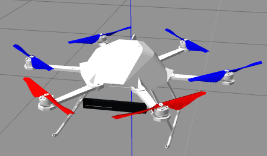
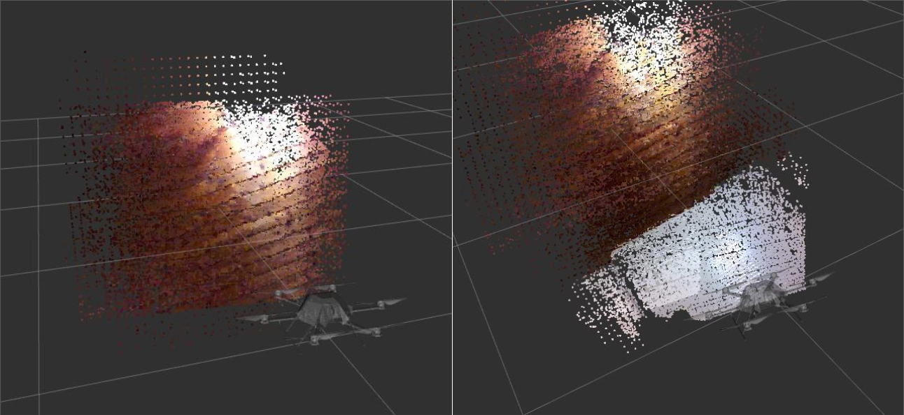
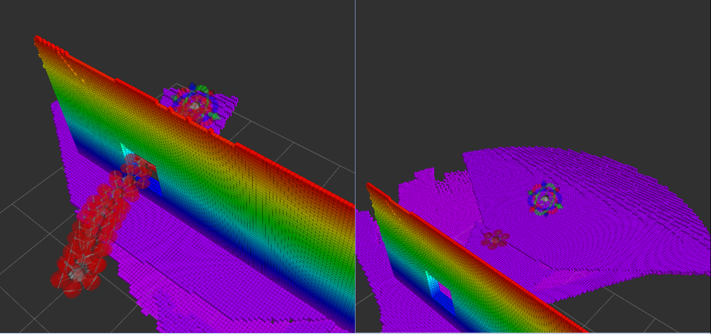
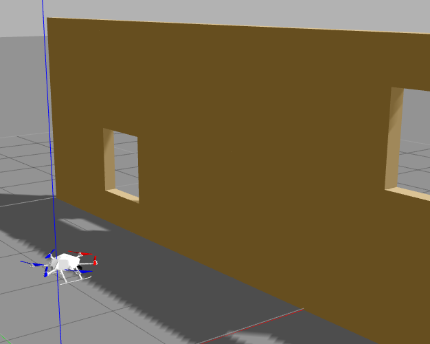
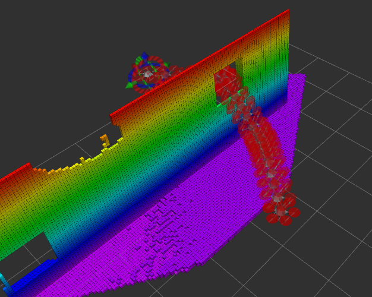
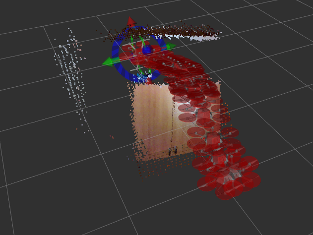

## UAV Navigation System with AscTec Firefly and Intel RealSense R200 Camera


This repository presents a solution for Unmanned Aerial Vehicle (UAV) navigation inside unknown, dynamic and GPS-denied environments. It attends to the topics of 3D Simultaneous Localization and Mapping (SLAM), object avoiding trajectory planning and execution of the trajectory following motions. The implementation is for simulation and real world.

- The first task was to create a Unified Robot Description Format (URDF) model of the UAV and the camera. The URDF model has to include sensor and actuator plugins for the camera, imu and rotors so it can be simulated with all its properties in Gazebo. The model serves also an important role in real environment. The motion planning algorithm uses the collision model when it calculates the object avoiding trajectories.



- 3D SLAM is implemented using the camera and firefly sensors. We create a 3D Map of the environment by using pointcloud data from the camera and odometry data. Odometry data within indoor, gps-denied environments is created using the Extended Kalman Filter (EKF) from Inertial Measurement Unit (IMU) data and Visual Odometry data. Additionaly in outdoor cases when we have access to GPS data we can include this as an input in the EKF and improve on the odometry accuracy.



- In the next step we create an motion trajectory with open motion planning algorithm which consider obstacles from the generated map. This planning is in realtime, considers new appearing obstructions and creates a trajectory avoiding them.

- In the last step we create a custom designed controller for the UAV which executes the 6-DOF trajectory following motion.


### Installation Instructions for Ubuntu 16.04 with ROS Kinetic


1. Install and initialize ROS kinetic desktop full.

2. Install additional packages:

```
$ sudo apt-get install ros-kinetic-moveit ros-kinetic-rtabmap-ros ros-kinetic-mavlink ros-kinetic-mav-msgs ros-kinetic-robot-pose-ekf ros-kinetic-octomap-ros ros-kinetic-joy python-wstool python-catkin-tools protobuf-compiler libgoogle-glog-dev ros-kinetic-control-toolbox ros-kinetic-mavros
```

3. Install realsense r200 camera by following instructions on:

http://wiki.ros.org/realsense_camera

4. Create and build catkin workspace with the project:

```
$ mkdir -p ~/catkin_ws/src
$ cd ~/catkin_ws/src
$ git clone https://github.com/nihsal/uav_navigation.git
$ cd ~/catkin_ws/
$ catkin build
```

It might require to build joint_trajectory_action_controller first independently with:

```
$ catkin build joint_trajectory_action_controller
```

In case of "error no module future":

```
$ sudo apt-get install python-pip
$ pip install future
```


5. Add sourcing to your `~/.bashrc` file:

```
$ echo "source ~/catkin_ws/devel/setup.bash" >> ~/.bashrc
$ source ~/.bashrc 
```

### Usage Instructions for the Simulated Environment

```
$ roslaunch uav_navigation_bringup simulation_bringup.launch
``` 

This launch file will start a gazebo simulation of a hovering firefly with an attached r200 camera and a wall with two windows in front. 

Gazebo            |  RVIZ
:-------------------------:|:-------------------------:
  |  

At the same time in parallel it will launch Moveit in Rviz for trajectory planning. 


### Usage Instructions for the Real-world Implementation

Connect the r200 camera and launch:

```
$ roslaunch uav_navigation_bringup uav_bringup.launch 
``` 

This launch file will initiate the camera, generate visual odometry, create a RTAB-Map of the environment and open Moveit in RVIZ for trajectory planning.



